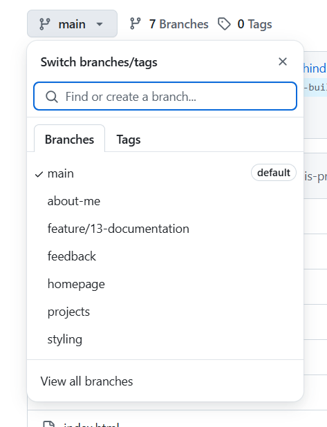

# Personal Portfolio Documentation

## 1. Student Details

- **Full Name: Ephraim Loch Juma**:
- **GitHub Username: @ephraimjuma**:
- **Email: ephraim.juma@strathmore.edu**:

## 2. Deployed Portfolio Link

- **GitHub Pages URL: https://is-project-4th-year.github.io/build-your-portfolio-github-workflow-essentials-ephraimjuma/**:  

## 3. Learnings from the Git Crash Program

List at least **four key concepts or skills** you learned during the Git crash course. For each one, write a brief explanation of how it helped you manage your portfolio project more effectively.

- **Pull Requests:** I have learnt how to make a pull request when trying to update a feature from a sub-branch into a main branch. They enable code review and discussion before merging changes
- **Branch Protection rules:** Is necessary in order to prevent force pushes and accidental deletion of important branches.
- **Merge Conflicts:** Can be resolved by editing the conflicting files locally and pushing the fixes.
- **Deployment:** The index.html is deployed.

## 4. Screenshots of Key GitHub Features

### A. Milestones and Issues

- Screenshot showing your milestone(s) and the issues linked to it.

 
- This image shows the milestones I have for my project.

- This image shows the issues i have in my project. They are connected to specific milestones

### B. Project Board

- Screenshot of your GitHub Project Board with issues organized into columns (e.g., To Do, In Progress, Done).

### C. Branching

- Screenshot showing your branch list with meaningful naming.

### D. Pull Requests

- Screenshot of a pull request that’s either open or merged and linked to a related issue.

### E. Merge Conflict Resolution

- Screenshot of a resolved merge conflict (in a pull request, commit history, or your local terminal/GitHub Desktop).
